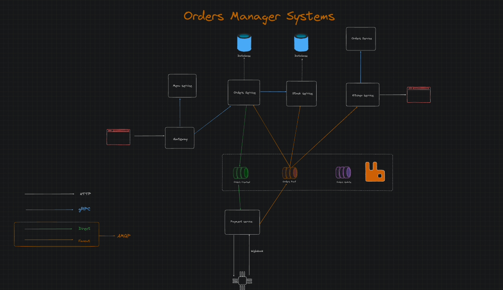

## Orders Manager Systems



## Create Orders
```cmd
    curl -X POST http://localhost:3000/createOrder \
    -H "Content-Type: application/json" \
    -d '{"item": "Pizza", "quantity": 2}'
```

##  Get Order Status
```cmd
    curl -X GET "http://localhost:3000/orderStatus?orderId=<order_id>"

```

##  Check stock
```cmd
  curl -X GET "http://localhost:3000/checkStock?item=Pizza"

```

##  Prepare Order
```cmd
    curl -X POST http://localhost:3000/prepareOrder -H "Content-Type: application/json" -d '{"orderId": "<order_id>", "item": "Pizza", "quantity": 2}'
```
## Process Payment
```cmd
    curl -X POST http://localhost:3000/processPayment -H "Content-Type: application/json" -d '{"orderId": "<order_id>", "amount": 19.99}'
```